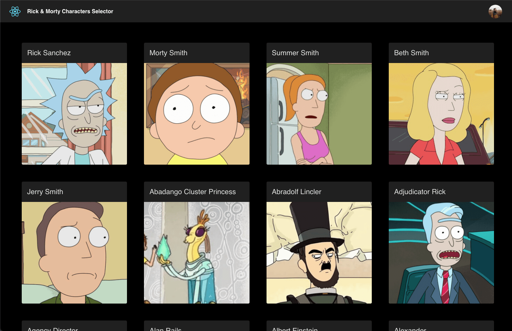

# Rick and Morty React

This progressive web app (PWA) is a Rick and Morty character selector made with [React](https://reactjs.org/),
[GraphQL](https://graphql.org/) and use as a backend the [Rick and Morty api](https://rickandmortyapi.com/).
With this application you will be able to choose one of the more than 600 characters available and see his detail information.

This project was the core project that I use to made a serie of three internal workshops for the [uxland](https://www.uxland.es/) members during the last 2 month of 2020.
In these workshops I made a talk about [Pact.js](https://github.com/pact-foundation/pact-js), another about [GraphQL](https://graphql.org/), and about [React](https://reactjs.org/).
This project is with educational purpose, therefore is not an application for profit neither fit for production.

## Demo

You can see the demo [here](https://rick-and-morty-8345b.web.app/).

## Start the app locally

 `yarn start`

Runs the app in the development mode.\
Open [http://localhost:3000](http://localhost:3000) to view it in the browser.

## Build for Production

`yarn build`

Builds the app for production to the `build` folder.\
It correctly bundles React in production mode and optimizes the build for the best performance.
